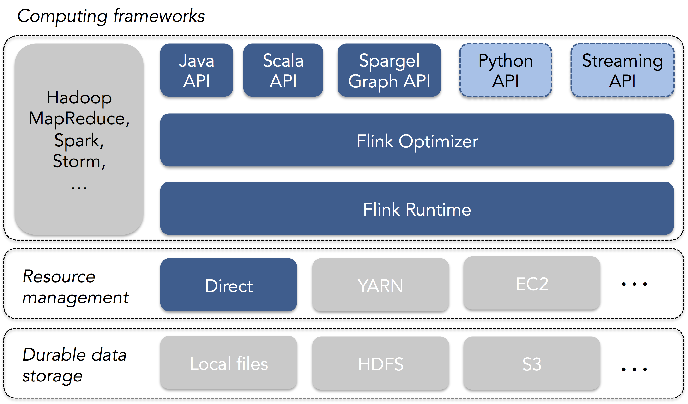

# Apache Flink: new kid on the block

> 原文来自[这里](http://data-artisans.com/apache-flink-new-kid-on-the-block/)，原作者[Kostas Tzoumas](http://data-artisans.com/author/kostas/)

Apache Flink(孵化中)是apache软件基金会支持下的新孵化项目。 Flink是Hadoop生态系统中应对***<u>分布式数据处理</u>***的一种新方法。
>>>注：flink是一个分布式数据处理引擎

我们坚信Flink代表了Hadoop生态系统中分布式计算引擎的下一次革命。Flink构建的基础下面这个原则：
>像过程语言一样书写，像数据库一样执行。

对于熟悉Hadoop生态系统中流行工具的开发人员来说，使用Flink是很容易的。但在后台，Flink引入了一系列创新性的特性，这使得Flink应用程序更加高效、鲁棒、使用和维护更容易。

Flink 用户可以使用Flink的APIs进行编程，目前Flink提供Java和Scala的API，也提供Spargel API，它实现了Pregel编程模型。其他的APIs，如Python API和数据流API正在开发中。Flink API大多沿用熟悉的模型，即分布式对象容器上的块变换，这是被MapReduce引入并被Apache Spark进一步扩展的编程范式。

>>>注：这就使所谓的编程范式，MR、Spark、Flink均定义了一套相互类似的编程范式，应用程序（Application）开发使用这一套编程范式，就可以实现自己的业务逻辑，而该逻辑会被解析成可分布式执行的代码，运行在计算平台之上。

如下是大数据应用中的“Hello, world”程序--WordCount，使用了Flink的Java API：

    DataSet text = …;
	DataSet<tuple2<string,integer>> counts = text
		.flatMap ((words, out) -> {
    		String[] tokens = value.toLowerCase().split("\W+");
    		for (String token : tokens) {
      			out.collect(new Tuple2<string, integer>(token, 1));
    		}
		})
		.groupBy(0)
		.sum(1)
and the same program in Flink’s Scala API:
同样的程序使用Flink的Scala API：
	val text = ...
	val counts = text.flatMap { words => words.toLowerCase.split("\W+") }
		.map { word => (word, 1) }
		.groupBy(0)
		.sum(1)

（你可以在Flink的官网上查看更多Flink的样例程序）
由于Flink提供了一种相同的打包机制，系统内部使用了一种统一的技术，这使得Flink与其他DAG的处理系统区分开来。
>>> 这里应该在暗指Spark

1. 内存与磁盘（存储）：用户不需要（额外）优化内存使用以提高（应用）程序表现。
2. 程序优化：很大程度上，用户不需要为应用程序进行调优。
3. 批和流：在一个系统上，用户可以在应用程序中结合使用真正的流处理操作和批处理操作
4. 原生迭代：这个系统为遍历数据提供了内置机制，这使得机器学习和图应用程序更快。

## 内存与磁盘处理

流行的数据处理引擎会按照如下两个场景进行设计优化，即：1.被处理数据集恰好能够全部放入内存；2.被处理数据集太大以至于不能全部放在内存。Flink的运行时机制（runtime）可以在两个场景下均获得很好的表现：当数据集能够在内存中放下，Flink可以有很好的性能表现，同时Flink仍能很优雅地应对内存压力，无论内存压力来自于数据集太大不能放在内存，或其他同时运行的应用程序消耗了内存。

## 程序优化

在Flink上，用户写的代码并不是执行的代码，在Flink中job运行前会生成运行代码，该代码是在基于Cost的优化阶段产生的。这个阶段会为应用程序选择一种执行计划（execution plan），而这是基于特定的数据集（使用数据的统计信息）和集群（运行应用程序的集群）进行专门优化过的。

这一点对Flink应用程序的可移植性和易维护性是有很大帮助的，这将大大提高开发者的生产效率，因为作为开发人员的程序员不需要关系底层优化还能保证良好的执行性能。

优化带来的一个好处是Flink应用程序可以很大程度上容忍潜在的数据变更和集群使用情况的变更，而不需要为这些变更重写或重调（程序）。另一个通用的好处是“一次编写，到处运行”，即：当用户在笔记本上开发了一个应用程序，不需要对应用程序代码进行任何更改，就可以将它运行到集群上。

## 批和流

另一个经常被讨论的是批处理系统和流处理系统的差异性，Flink是一个基于流处理运行时引擎的批处理系统。有点疑惑？Flink的运行时机制并**不是**按照如下思路进行设计：算子在启动前要一直等待其前驱算子运行结束；而**是**算子可以消费产生的部分结果集。这被称之为**<u>流水线并行机制</u>**，这意味着在Flink程序中的多个转换（算子）在同时执行，它们各自处理的数据来自于（各自的）内存和网络通道（channel）。
最终结果是鲁棒的性能表现，同时具有在同一个系统中混合使用批处理和流处理的能力。在Flink基础上，社区已经创建了一个[数据流处理原型](https://github.com/apache/incubator-flink/tree/master/flink-addons/flink-streaming)，不久将可用。

## 原生迭代处理

数据迭代处理，即在同一份数据上多次执行应用程序，这已经引起了很大的关注，主要是涉及到训练机器学习模型或图数据的应用程序越发受到重视。Flink引入了专门的“iterate”算子，它可以创造一个封闭循环（closed loop），这允许系统可以优化迭代程序，而不是将迭代程序看作是对独立job的多次调用（这是外部循环调用）。无论是外部循环调用还是封闭循环都有其适用场景，在同一个系统下同时拥有两种算子将是十分有用的。

## Flink的社区、历史和生态系统

Flink起源自Berlin的数据管理研究团体，特别是Stratosphere研究项目。Stratosphere开始于2009年，通过结合MapReduce引擎和传统的DBMS引擎思路，研究人员着手创建一个开源系统，使其能够兼具这两者的优点。
经过数年发展Stratosphere成长为一个活跃的开源项目，工业派和学院派的贡献者都为其贡献代码。社区考虑到Apache软件基金可以为这个项目提供更持久的帮助，可以是确保这个项目的发展和社区化进程，因此考虑将其捐献给社区。
虽然在Apache的生态系统中Flink是一个新的项目，但它已经拥有了一个稳定且快速发展的社区。到目前，超过50个人为其贡献过代码。在进入Apache孵化器之后这个项目又增加了3个committer。最后，在整合Flink与其他系统上会有越来越大的兴趣。这些努力方向的迹象包括：Apache MRQL可以运行在Flink上，其他正在发生的有：整合Flink与Apache Tez、整合Flink与Apache Mahout。
最近，Apache Flink的核心贡献者团队组建了一个基于Berlin的公司--Data Artisans，将持续为Flink进行开发，并将一直保持开源。

## 总结
随着这篇博客的贴出，我试图给出一些关于这项新技术的指点，以及Flink背后的设计理念，最终希望对终端用户有所帮助。
当然，这绝不是一个深入的探索或有关Flink新特性的详细列表！敬请期待这个博客的后续，Data Artisans的开发人员将贴出更多的细节描述，将有关于Flink如何工作。
Flink在持续活跃发展之中，社区将开发出一个个富有价值的新特性。同时，这个系统已经稳定并可以使用。开始使用Flink吧！