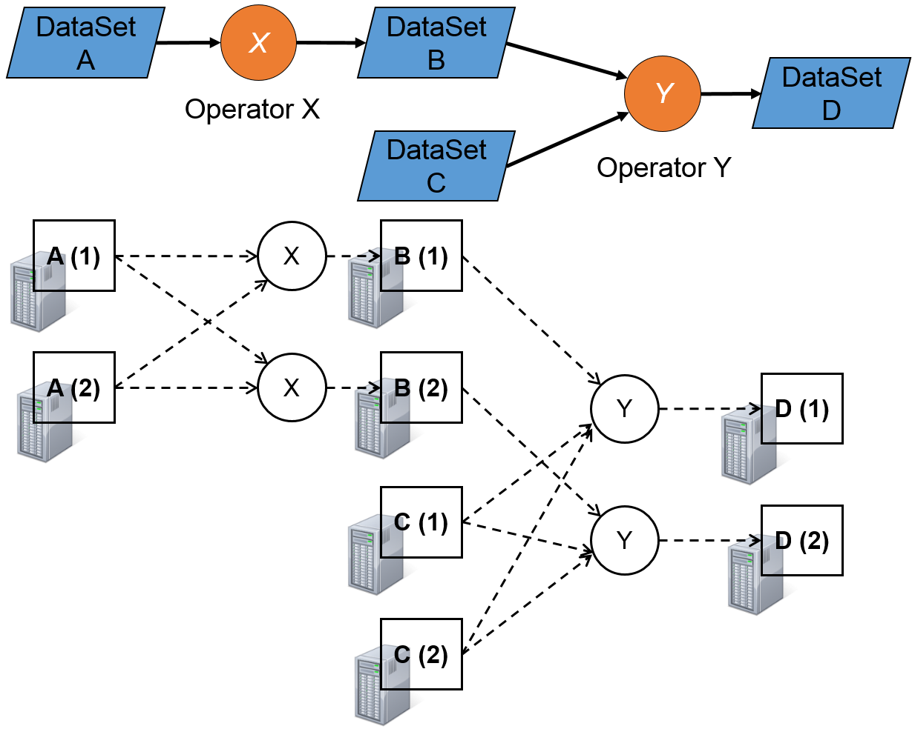
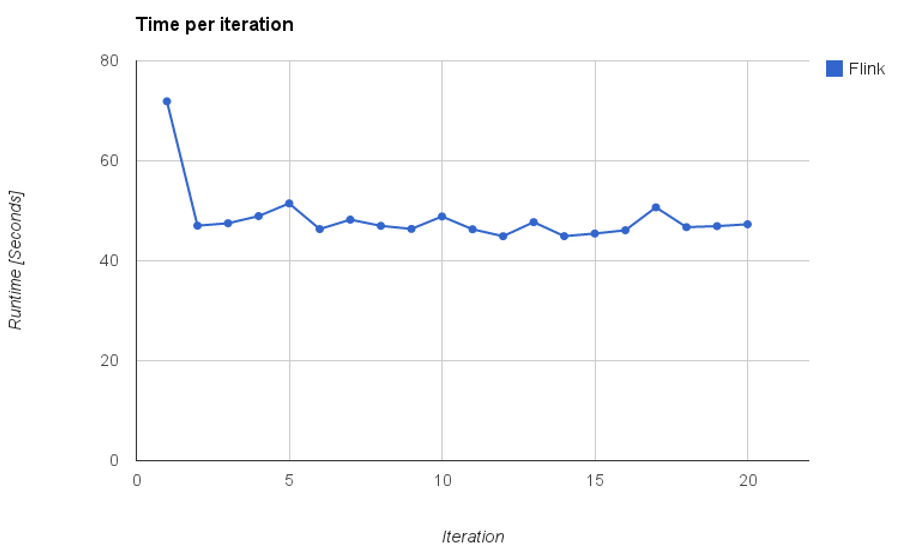
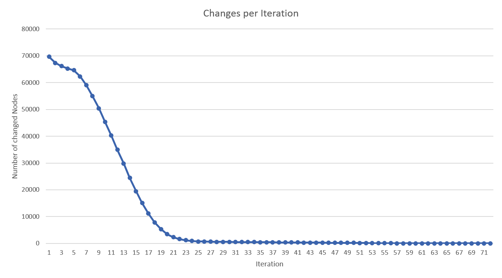
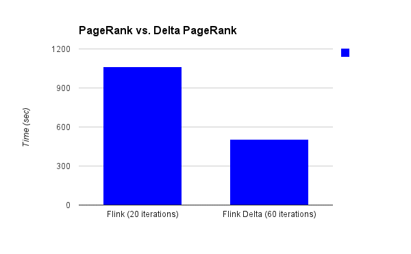
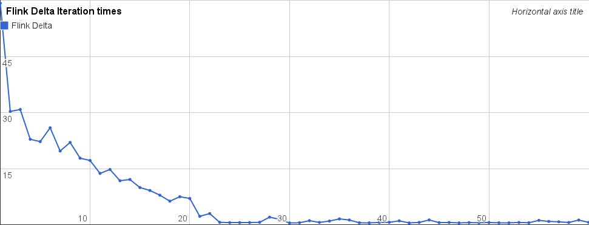

#Data Analysis with Flink: A case study and tutorial
> 原文来自[这里](http://data-artisans.com/data-analysis-with-flink-a-case-study-and-tutorial/)，原作者[Stephan Ewen](http://data-artisans.com/author/stephan/)

This article is a step-by-step guide to implement a fairly sophisticated data analysis algorithm, end-to-end in [Apache Flink](http://flink.incubator.apache.org/). We will use the [PageRank](http://ilpubs.stanford.edu:8090/422/1/1999-66.pdf)algorithm, an algorithm used for ranking entities in graphs (such as webpages in the web). We will go through Apache Flink’s APIs, the Flink iteration feature, optimization, as well as local and distributed execution and monitoring. All code samples are given in both Scala and Java.

这篇文章是一个手把手的教程，实现了一个相当复杂的数据分析算法，从头到尾在[Apache Flink](http://flink.incubator.apache.org/)上实现的。我们使用了[PageRank](http://ilpubs.stanford.edu:8090/422/1/1999-66.pdf)算法，这个算法用来给图上的实体（点）排序（比如网络上的网页）。我们将接触到Apache Flink的API，Flink的迭代（iteration）特性，优化（optimization），本地（local）和分布式（distributed）执行（execution）以及监控（monitoring）。所有样例代码都提供了Scala和Java版本。

The PageRank Algorithm

The original PageRank algorithm became famous as the basis of Google’s web search ranking. It determines the importance of a web page compared to other pages in the web graph, making use of the web graph’s link structure. Intuitively, it defines that a web page is important if many pages link to it, and these incoming links themselves derive their importance from their originating web page. A common interpretation of PageRank is the “random surfer” analogy: A web surfer that randomly follows links will end up on certain pages with a certain probability. That probability is the PageRank of that web page.

## PageRank算法

PageRank算法的流行得益于其是Google网页搜索排序的基础。它决定了在网络图上，一个网页与其他网页相比较的重要性，用到了网络图上的链接（link）关系。直觉上，如果很多网页指向（link，即该网页上带有目标网页url的标签/链接）某个网页，那么这个网页是重要的，同时传入链接（指向）将源起网页的重要性传入到了目的网页。PageRank的通常理解是类比随机上网：一个上网者根据link进行随机游走，最后以某个特定概率停留在某个特定网页。这个概率值就是这个网页的PageRank值。

Since its original publication, variations of PageRank has been applied to surprisingly many domains. PageRank has been used to create recommendations ([Who to follow on Twitter](http://www.stanford.edu/~ashishg/papers/wtf_overview.pdf)), for publication disambiguation and [word sense disambiguation](http://www.cl.cam.ac.uk/teaching/1213/L113/PAMI.pdf), and even in biochemistry to find candidate [protein interations](http://www.researchgate.net/publication/235402799_Equal_Opportunity_for_Low-Degree_Network_Nodes_A_PageRank-Based_Method_for_Protein_Target_Identification_in_Metabolic_Graphs/file/9c9605244024ea228b.pdf) in the metabolism.

PageRank算法一经公布，各种变体已经在许多领域进行了应用。PageRank已经被用于产生推荐内容（在Twitter上follow谁），出版物消歧，词义消歧，甚至于在生物化学上在新陈代谢过程中发现候选蛋白质相互作用（？）。

Sample Data

To play around with the PageRank algorithm, virtually any graph data set will do. For validation and debugging purposes, we use a small random data sample, consisting of a handful of nodes and edges. For later evaluations, we use a snapshot of the Twitter follower network, described [here](http://an.kaist.ac.kr/traces/WWW2010.html) and available for download [here](http://konect.uni-koblenz.de/networks/twitter).

There are various formats in which to represent the graph data. In the course of this article, we assume that the graph is represented through an “adjacency list”, where every node is listed together with its outgoing edges.

## 样例数据

在使用PageRank算法时，几乎任何图数据集都可以使用。为了验证和调试，我们使用一个小的随机数据样本，由少量的点和边组成。为后续评估，我们使用Twitter网络中的一个快照，其描述见[这里](http://an.kaist.ac.kr/traces/WWW2010.html)下载在[这里](http://konect.uni-koblenz.de/networks/twitter)。
表示图数据的方式有很多种。在本文的论述中，我们假设图使用的是邻接表的形式存储的，即每个点和它的出边组织在一起。

	(page)                (link1)                 (link2)                 
	www.pageUrl.com/site  neighbor.org/otherPage  www.otherPage.org
	www.otherPage.org     www.target-page.gov     neighbor.org/otherPage

The URLs are used only as identifiers for the pages, and we can use any other type of identifier as well. For the sake of simplicity, we use numbers as identifiers in this article with each number representating a web page:

URL只是网页的一个标识符，我们可以使用任何其他形式的标识符替代它。为了简单起见，我们使用数字作为标识符，在这篇文章中，每个数字代表了一个网页：

	17 23 42
	42 19 23

Enter Apache Flink

Flink is a general-purpose system for parallel data processing, like Hadoop and Spark. Flink has high-level APIs for data analysis programs that can be executed in parallel on a cluster of machines. Flink’s APIs offer powerful operations that make it a good match for graph algorithms like PageRank.

The core element of Flink’s APIs are DataSets, which represent a collection of data elements will be computed and stored in a distributed fashion. Data sets can be loaded for example from (distributed) files or Java/Scala collections, and they are produced by running computations on other data sets.

# 进入Apache Flink
Flink 是用于进行并行数据处理的通用系统，正如Hadoop和Spark。Flink为数据分析程序提供了high-level的API，使其可以在集群上并行执行。Flink的API提供功能强大的算子，这可以为图算法提供一个很好的选择，比如：PageRank。
Flink API的核心元素是DataSets，它代表数据元组的集合（Collection），这个集合存储在分布式系统中并可以被用于计算。数据集可以从（分布式）文件中加载得到，或者是Java/Scala的集合（Collection），还可以通过在其他数据集上进行运算而产生。

Implementing PageRank

We’ll get started by getting some data into Flink. Then, we will create a program that computes one step of the PageRank algorithm. Finally, we will enclose that step in an iteration to complete the algorithm.

## PageRank的实现
我们从Flink加载数据开始，之后我们创建一个应用程序使其能够计算PageRank算法的一个迭代，最后，我们将完善这个算法使其能够迭代进行。

One step of PageRank

The following code creates an execution environment (this is the entry hook for Flink programs) and creates our source data set.

### PageRank的一个迭代
接下来的代码将创建一个运行时环境（这就是Flink程序的入口代码）同时创建源数据集。

	def main(args: Array[String]) {

		// 获取默认的执行环境
		val env = ExecutionEnvironment.getExecutionEnvironment
  
		// 从Java序列中获取一个数据集
		val rawLines : DataSet[String] = env.fromElements(
			"1 2 3 4",
			"2 1",
			"3 5",
			"4 2 3",
			"5 2 4")

		// 在运行真实数据集时，我们将使用下面的语句从文件中读取。
		// val rawLines = env.readTextFile("hdfs:///demodata/twitter-followers")
	}

We can now do a bunch of things with the created data set, like running parallel computations on it, or writing the data somewhere. The following lines tell the system to print the data set to standard output. Note that the env.execute()command triggers the execution – the data sets are not created and no operations are run before that command is called. After those lines are added, we can simply execute this program in our IDE as a Java/Scala application (e.g., by right clicking on the class and choosing “Run”).

我们对创建好的数据集将进行一系列的操作，如：在其上运行并行计算，或将该数据写到某个地方。接下来的几行代码将告诉系统把数据集打印到标准输出中。注意：`env.execute()`代码将触发整个执行--在这行代码调用之前，任何数据集都不会创建，任何操作都不会进行。把这几行代码加上，我们就可以在IDE上简单执行这个程序，正如一个普通的Java/Scala应用程序一样（即，通过在class上右键并选择“Run”）。

	rawLines.print()
	env.execute()

Let us now define the parallel computations that together form the PageRank algorithm. We start by defining the data types on which the algorithm works. The Page type refers to a page (identified by its id) with a rank. The Adjacency type defines the neighborhood of a page. It contains the page id and the ids of all neighbors. We add utility constructors and a parse method for convenience.

我们来定义构成PageRank算法的并行计算过程。首先定义的是算法运行所需的数据类型。其中Page指定了一个带rank值的网页（通过其id识别），Adjacency定义了一个网页的邻居，它由网页id和所有邻居id组成的集合所构成。为方便，我们添加了一个实用的构造器和一个解析方法。

	case class Page(id: Long, rank: Double)
	
	case class Adjacency(id: Long, neighbors: Array[Long])

Next, we prepare the data sets on which our algorithm works. So far, our original data set contains a collection of strings that define the adjacent pages for each page. Let us parse these strings and create the proper data types. We also create the initial rank distribution by creating a data set of pages where we assign equal ranks to pages (i.e., each page gets as its rank 1 divided by the number of pages).

接下来，我们准备算法运行的数据集。到目前，我们原始的数据集中有一个string构成的集合，每个string都定义了一个网页及其邻接网页。接下来我们解析这些string并创建合适的数据类型。我们也给创建的网页数据集设定了初始的rank分布，这里我们给每个网页相同的rank值（即：每个页面的rank值设置为网页数的倒数）。

	val adjacency : DataSet[Adjacency] = rawLines
		.map( str => { 
			val elements = str.split(' ')
			val id = elements(0).toLong
			val neighbors = elements.slice(1, elements.length).map(_.toLong)
			Adjacency(id, neighbors)
		} )

	val initialRanks : DataSet[Page] = adjacency.map { adj => Page(adj.id, 1.0 / NUM_VERTICES) }

With these two data sets, we can now implement the core PageRank step: In the [PageRank formula](http://data-artisans.com/data-analysis-with-flink.html#pagerank_formula), the new rank of a page is the sum of the ranks of the neighboring pages that point to it (weighted by how many outgoing links the source pages have, and the dampening factor). We implement this in two operations:

1. Each page distributes its rank to all the neighbors. The page takes its total rank, divides it by the number of neighbors and “contributes” that partial rank to all its neighbors.
2. For each page, we sum up those partial ranks, to get the new rank.

To reproduce the PageRank formula correctly, we need to account for the dampening factor and the random jump. We apply the dampening factor when the ranks are distributed to the neighbors. Every page contributes the random jump to itself – that way this term is created exactly once for each page, including those that have no pages that point to them.

有了这两个数据集，我们可以实现PageRank算法的核心步骤：在PagaRank的标准形式中，每个网页新的rank值是所有指向它的邻接网页的rank值之和（其权重由源网页的出边数量和抑制因子决定）。我们在以下两个算子中实现这个过程：
1. 每个网页将它的rank值平均分配给所有的邻接网页。首先这个网页获取其总的rank值，除以其邻接网页数量，并将部分rank值分配给它所有的邻接网页。
2. 对每个网页，汇总其所有部分rank值，得到新的rank值。

为了准确地复制PageRank标准形式，我们有必要解释清楚抑制因子和随机跳。我们在rank值被分配到其邻接网页上时使用抑制因子。每个网页都可能随机跳到任何网页--那样，每个网页都会创建一个随机跳，包括那些没有任何网页指向的网页。
	// 为page rank算法定义一些常量
	private final val DAMPENING_FACTOR: Double = 0.85
	private final val NUM_VERTICES = 82140L;
	private final val RANDOM_JUMP = (1-DAMPENING_FACTOR) / NUM_VERTICES;
	
	val rankContributions = initialPages.join(adjacency).where("id").equalTo("id") {
	
	//使用flat join，可以将两种类型（左边，右边）放到一起（这里是page和adj）
	//并产生多个结果元素
		(page, adj, out : Collector[Page]) => {
			val rankPerTarget = DAMPENING_FACTOR * page.rank / adj.neighbors.length;
    
			//将随机跳到自身的随机跳发送出去
			out.collect(Page(page.id, RANDOM_JUMP))
    
			//将部分的rank值发送给每个邻居
			for (neighbor <- adj.neighbors) {
				out.collect(Page(neighbor, rankPerTarget));
			}
		}
	}
      
	val newRanks = rankContributions
		.groupBy("id").reduce( (a,b) => Page(a.id, a.rank + b.rank) )

With those steps, we have the core step of the PageRank Algorithm in place. If we print the results and execute program, we see the approximation of the ranks after one step:

使用这些步骤，我们已经完成了RageRank算法的核心步骤。如果执行这个程序并打印结果，经过一个步骤后，我们可以看到看到rank值得近似结果：

	1: 0.2
	2: 0.2566666666666667
	3: 0.17166666666666666
	4: 0.1716666666666667
	5: 0.2

Making the Algorithm iterative

To create the iterative variant of the algorithm, we use Flink’s iteration construct to define the loop.

We create an IterativeDataSet and use it as the basis of the page rank step. After the PageRank step, we “close the loop” with the data set containing the new ranks. Closing the loop tells the system to use the new ranks the next time it executes the PageRank step. Note how the code below uses the iterative set pages in the computation of the rankContributions and later closes the iteration with the newRanks data set.

Note that in Scala, we make use of Scala’s concise functional syntax and embed the iteration step in a nested function of type DataSet[Page] => DataSet[Page]. The function takes the iterative data set and returns the one that is used to close the loop.

### 使算法迭代进行

为构建算法的迭代版本，我们使用Flink的iteration算子定义循环。
我们创建一个**IterativeDataSet**，并将其用作page rank步骤的基础。在PageRank步骤后，我们关闭这个循环并获得一个包含有最新rank值得数据集。关闭这个循环（close the loop）告诉系统在下一次执行PageRank步骤时使用新的rank值。注意下面的代码如何在计算rankContributions的过程中迭代设置网页，并在之后关闭迭代使数据集带有newRank值。
注意在Scala中，我们使用Scala简明的函数式语法，将迭代步骤嵌入到如下嵌套函数中`DataSet[Page] => DataSet[Page]`。这个函数获取迭代的数据集，返回关闭loop时得到的数据集。

	val iteration = initialRanks.iterate(numIterations) {
		pages => {
			val rankContributions = pages.join(adjacency).where("id").equalTo("id") {
				(page, adj, out : Collector[Page]) => {
					val rankPerTarget = DAMPENING_FACTOR*page.rank/adj.neighbors.length;
        
					// send random jump to self
					out.collect(Page(page.id, RANDOM_JUMP))
        
					// partial rank to each neighbor
					for (neighbor <- adj.neighbors) {
						out.collect(Page(neighbor, rankPerTarget));
					}
				}
			}
    
			rankContributions.groupBy("id").reduce( (a,b) => Page(a.id, a.rank + b.rank))
		}
	}

If we run this program in our IDE and look at the log in the console, we see some messages that the operations start and finish their iterations (sample), and we see a final result:

当我们在IDE上运行这段程序可以看到console中的log信息，我们看到一些信息额：算子启动和结束迭代，我们看到的最终结果如下：
	INFO task.IterationIntermediatePactTask: starting iteration [22]:  Join (flink.tutorial.pagerank.PageRank$3) (1/4)
	INFO task.IterationIntermediatePactTask: finishing iteration [22]:  Join (flink.tutorial.pagerank.PageRank$3) (1/4)
	INFO task.IterationIntermediatePactTask: starting iteration [22]:  Join (flink.tutorial.pagerank.PageRank$3) (4/4)
	INFO task.IterationIntermediatePactTask: finishing iteration [22]:  Join (flink.tutorial.pagerank.PageRank$3) (4/4)
	INFO task.IterationTailPactTask: finishing iteration [22]:  Reduce(flink.tutorial.pagerank.PageRank$4) (1/4)
	INFO task.IterationTailPactTask: finishing iteration [22]:  Reduce(flink.tutorial.pagerank.PageRank$4) (2/4)

	1: 0.2380722058798589
	2: 0.24479082825856807
	3: 0.17046158206611492
	4: 0.17178303768658085
	5: 0.17489234610887724  

Note that we used a fixed number of iterations. There are various ways to extend the algorithm to check for convergence and terminate accordingly.

注意：我们使用了固定的迭代次数。有多种方法扩展这个算法，如检查收敛和适时停止。

On large data

To try the algorithm on a real data set, we run it over the Twitter follower graph described in the introduction. We read the adjacency lists as a text file and keep the remainder of the algorithm unchanged.

### 大数据集上运行

在真实数据集上尝试这个算法，我们在前面提到的Twitter的follower图上运行这个算法。将邻接表以文本文件的方式读取进来，算法的剩余部分不做改变。
	DataSet rawLines = env.readTextFile("hdfs:///demodata/twitter-followers");

The graph has 41,652,230 nodes (users) and 1,468,365,182 edges (followings). The chart below shows the runtimes on a small cluster setup of 24 machines with 8 cores with 20 GiBytes of main memory for each machine. The execution time of the first iteration is larger, because it includes the initial preparatory operations.

这个图有41,652,230节点（用户）和1,468,365,182边（关注关系）。下面这个图标展示了在一个小集群上的运行时信息，集群由24台机器构成，，每台机器8个core和20GB内存。第一次迭代时间稍长，因为它包括了初始化准备算子的时间。

Looking at our Program

To get a better understanding of our program, we examine it in Flink’s plan visualization tool. Flink can dump a JSON representation of the program’s data flow and render it in a web browser.

We simply replace the statement env.execute() withSystem.out.println(env.getExecutionPlan()) and run the program to get a printout of the JSON dump. We paste the JSON on the pagetools/planVisualizer.html in the Flink home folder.

### 复查程序
为了对程序获得更好的理解，我们使用Flink的执行计划可视化工具对其进行查看。Flink可以导出一个JSON形式的程序数据流并可将其渲染到浏览器上展示。
我们只需简单将`env.execute()`语句替换成`System.out.println(env.getExecutionPlan())`，并运行这个程序就可以获得打印出的JSON dump。我们将JSON串复制到Flink主页文件夹下的`tools/planVisualizer.html`网页上（已经移至[这里](http://flink.apache.org/visualizer/index.html)）。

In the program plan, each small box represents an operation and between the operations, we see at which points the system shuffles and sorts data. The large box represents the iteration. We can see that the join uses a hash join strategy and the hash table is cached across iterations.

在程序的执行计划中，每个小方框代表了一个算子，在算子之间可以看到系统交换和排序数据的过程。大方框代表了迭代过程，可以看到join操作使用了hash join的策略，同时hash table在跨越迭代时是缓存的。

Going further – Delta Page Rank

While the above presented variant of PageRank performs already well, there is a way to further improve it significantly by using one of Apache Flink’s unique features: stateful iterations.

The PageRank algorithm exhibits two characteristics that most graphs (and machine learning) algorithms exhibit in practice: sparse computational dependencies and asymmetric convergence.

To illustrate that, let us look at the actual changes that PageRank computes in each iteration. The graph below shows how many nodes in the graph actually change their rank by more than a certain minimal threshold (on a sample graph of 80,000 nodes). One can see that most nodes change their rank only in the first few iterations and remain stable afterwards.

### 更进一步-增量PageRank

以上展示的PageRank实现其性能已经很好，还有一种方法可以进一步显著提升其性能，使用Apache Flink另一个独有特性：有状态迭代。
PageRank算法展现了两个特性-这在大多数图算法（机器学习算法）实践中有体现：*稀疏的计算依赖*和*不对称的收敛*。
为阐述清楚这一点，让我们实际看看PageRank计算过程在每轮迭代中的实际变化。下面这张图展示了在图中多少节点实际更改了其rank值，如果小于一个固定的小阈值则认为其没有更新（在一个80,000节点的小图上进行）。可以看出大多数节点只有在起初的有限迭代过程中改变了其rank值，之后就保持稳定不再更新。

If we can change the algorithm such that it works only with the changed vertices, in each step, we can significantly improve the algorithm runtime. In fact, much of the design of graph processing systems like [Apache Giraph](http://giraph.apache.org/) and [GraphLab](http://graphlab.org/projects/index.html) was made exactly to exploit those characteristics.

如果我们更改算法，让其在每一轮迭代中，使它可以在更新的节点上工作，那么我们可以显著改善算法的运行时表现。事实上，大多图计算引擎的设计思路恰好完整利用了这些特征，如：[Apache Giraph](http://giraph.apache.org/)、[GraphLab](http://graphlab.org/projects/index.html)。

Delta PageRank Algorithm

The first step to exploit that characteristic is to rewrite the algorithm to work with rank deltas, rather than with the absolute rank values. In each iteration, nodes send delta changes to other nodes (depending on their own change) and sum up the deltas to the final delta, which is added to the current value.

The code below shows the core of the delta PageRank algorithm, which is only slightly different from the original version above. The second operation adds up all partial deltas and filters the final delta by a threshold.

Note that we are not using the Page and Adjacency classes here, because Flink’s delta iterations support only tuples in the current release. We use 2-tuples (page-id, rank) instead of Page and (page-id, neighbors[]) instead of Adjacency.

### 增量PageRank算法

利用这个特性的第一步是重写算法使其能够工作在rank增量更新上，而不是工作在绝对增量值。在每一轮迭代中，节点将其改变量（增量）发送给其他节点（依赖于其改变），把增量汇总到一起就得到了最终的改变量（增量），这个增量值会加到当前值上。
下面的代码展示了增量PageRank算法的核心部分，与原始的版本比起来它只有很少的不同。第二个算子累加所有的部分增量值并利用阈值对最终的增量值进行过滤。
注意：在这里，我们没有用Page和Adjacency类，因为在当前发布的版本上，Flink的增量迭代逻辑只支持Tuple类型。我们使用2-Tuple（page-id，rank）代替Page，使用（page-id，neighbors[]）代替Adjacency。
	val deltas = workset.join(adjacency).where(0).equalTo(0) {
		(lastDeltas, adj, out : Collector[Page]) => {
			val targets = adj._2;
			val deltaPerTarget = DAMPENING_FACTOR * lastDeltas._2 / targets.length;
  
			for (target <- targets) {
				out.collect((target, deltaPerTarget));
			}
		}}
		.groupBy(0).sum(1)
		.filter( x => Math.abs(x._2) > THRESHOLD );

	val rankUpdates = solutionSet.join(deltas).where(0).equalTo(0) {
		(current, delta) => (current._1, current._2 + delta._2)
	}

These functions compute the deltas in each iteration based on the deltas in the previous iteration. To find our initial deltas, we run one step of the regular PageRank algorithm over the uniformly initialized ranks. Our first deltas are the differences between the result of that step and the uniform ranks.

The last piece that we need, is a way to keep unmodified nodes (pages) around as “state” across the iterations – Flink’s Delta Iterations can do that for us.

在每轮迭代中，这个函数在前一轮迭代增量值的基础上计算了新的增量值。为找到初始的增量值，我们在均匀分布的初始化rank值基础上，运行一个常规PageRank算法迭代。第一个增量值是第一轮迭代结果与均匀rank值之间的差异。
我们需要做的最后一步，也就是在跨越迭代时，需要一种方法来将保存未修改的节点（网页）在状态中，这是Flink的增量迭代可以提供的。

Delta Iterations in Apache Flink

Delta iterations in Flink privide functionality to split the iteration between state and workset. The state (otherwise called solution set) is where we keep the result that we actually want to compute, while the workset carries the data that drives the next iteration. In our case, the state is the data set of pages with their ranks, while the workset is the computed and filtered deltas.

### Apache Flink中的增量迭代

在Flink中,增量迭代提供了按照状态和工作集对迭代进行切分功能。状态--state（也可以称之为解集--solution set）是我们真正要计算出结果的保存位置，同时工作集携带着数据并驱动下一轮迭代。在我们的场景中，state是携带着rank值得page数据集，同时工作集是计算出过滤后的增量值。

The solution set is a distributed key/value data set that is partitioned over many machines. We can access it by joining (or co-grouping) with the data set on its key. To change or add elements to the solution set, we simply create a new data set (the solution set updates) that contains the new or updated elements. At the end of each iteration these updates are merged into the solution set, where elements replace previous entries with the same key (or are added, if no prior entry with the key existed).

For our PageRank algorithm, we use the page id as the key. At the end of each iteration, we create a data set that contains the pages whose rank changed (the updates) and deltas to be used in the next iteration (the next workset).

At runtime, Flink automatically keeps the solution set partitioned in an index. That way, joins with the solution set become index lookups, and updates to the solution set become index insertions/updates. For us that means that if a node is not used inside one iteration (because it is converged and did not change), its data is not accessed at all – it simply remains untouched in the index.

Here is the final code for PageRank as a delta iteration:

解集是一个分布式的key/value数据集，它分布在多台机器上。我们可以在数据集的key上进行joining（或co-grouping）来访问它。为改变解集或在其上增加元素，我们可以简单地创建一个新的数据集（解集的更新内容），它包含着新的或更改的元素。在每轮迭代的结束，这些更新会被归并到解集中，具有相同key的元素会替掉之前的数据条目（或者被添加，如果没有相同key下更优先的条目存在）。

对于PageRank算法，我们使用page id作为key。在每轮迭代结束时，我们创建一个数据集，它包含了那些更改了rank值的网页（即更新内容）和下一轮迭代用到的增量（即下一轮的工作集）。

在运行时，Flink在索引（key值？）上对解集自动分区保存。那样，与解集进行join操作将在成为在索引上的查找（lookup），在解集上的更新操作就是基于索引的插入/更新。对我们来说这意味着如果某节点在一个迭代内部没有被使用（因为它是收敛的，同时没有被改变），它的数据将不再被访问--在索引中它只是简单的存在未访问。
下面是PageRank作为增量迭代算法的最终代码：
	object DeltaPageRank {

		private final val DAMPENING_FACTOR: Double = 0.85
		private final val NUM_VERTICES = 82140L
		private final val INITIAL_RANK = 1.0 / NUM_VERTICES
		private final val RANDOM_JUMP = (1-DAMPENING_FACTOR) / NUM_VERTICES
		private final val THRESHOLD = 0.0001 / NUM_VERTICES
  
		type Page = (Long, Double)
		type Adjacency = (Long, Array[Long])
  
		def main(args: Array[String]) {

			val numIterations = 30;
  
			val adjacencyPath = "/path/to/adjacency.csv";
			val outpath = "/path/to/out.txt";
    
			val env = ExecutionEnvironment.getExecutionEnvironment
    
			val adjacency : DataSet[Adjacency] = env.readTextFile(adjacencyPath)
      			.map( str => { 
					val elements = str.split(' ')
					val id = elements(0).toLong
					val neighbors = elements.slice(1, elements.length).map(_.toLong)
					(id, neighbors)
				} )
          
			val initialRanks : DataSet[Page] = adjacency.flatMap {
				(adj, out : Collector[Page]) => {
					val targets = adj._2
					val rankPerTarget = INITIAL_RANK * DAMPENING_FACTOR / targets.length
      
					// dampend fraction to targets
					for (target <- targets) {
						out.collect((target, rankPerTarget))
					}
      
					// random jump to self
					out.collect((adj._1, RANDOM_JUMP));
				}
			}
			.groupBy(0).sum(1);
  
		val initialDeltas = initialRanks.map
			{ (page) => (page._1, page._2 - INITIAL_RANK) }
  
		val iteration = initialRanks.iterateDelta(initialDeltas, 100, Array(0) ) {
    
			(solutionSet, workset) => {
				val deltas = workset.join(adjacency).where(0).equalTo(0) {
					(lastDeltas, adj, out : Collector[Page]) => {
						val targets = adj._2;
						val deltaPerTarget =
							DAMPENING_FACTOR * lastDeltas._2 / targets.length;
          
						for (target <- targets) {
							out.collect((target, deltaPerTarget));
						}
					}
				}
				.groupBy(0).sum(1)
				.filter( x => Math.abs(x._2) > THRESHOLD );
  
				val rankUpdates = solutionSet.join(deltas).where(0).equalTo(0) {
					(current, delta) => (current._1, current._2 + delta._2)
				}
      
				(rankUpdates, deltas)
			}
		}
  
		iteration.writeAsCsv(outpath, writeMode = WriteMode.OVERWRITE)
  
		env.execute("Page Rank");
		}
	}

Performance

We run the delta-PageRank on the Twitter follower data set with the same setup. The graph below shows that the revised algorithm is out of the box twice as fast as the original algorithm. Looking closer, we see that it actually ran 60 iterations until it found that all deltas are small enough to consider the state converged, which makes the speedup compared to the 20 plain iterations (without convergence check) more significant.

### 性能表现

在Twitter数据集上使用相同的设置运行增量的PageRank算法。下图展示了这个改进的算法与原始算法比起来有了两倍速度的提升。更进一步观察，我们看到它实际运行了60个迭代才最终找到所有的增量都足够小并认为其状态达到收敛，与20个普通迭代（没有进行收敛检查）相比这将更加有意义。

Digging into the times spent in each iteration (chart below), we can see that the algorithm shows the expected behavior: The time spent in each iteration decreases quickly, and the long tail of the iterations take very little time each.

深入到每一个迭代中的时间开销（下图展示），我们可以看到这个算法具有预期的行为：用于每轮迭代的时间开销下降十分明显，迭代过程的长尾中每一轮迭代的时间开销都很小。

Dig further

The code used in the experiments can be found here:.

- [PageRank (Java – used for runtimes)](https://gist.github.com/StephanEwen/480b23e5ba34bf7ac349)
- [PageRank (Scala)](https://gist.github.com/StephanEwen/970297b4c3fe6c0cb4ce)
- [Delta PageRank](https://gist.github.com/StephanEwen/2b1a4c9812ac46abc8f0)
- [Delta PageRank collecting stats per iteration](https://gist.github.com/StephanEwen/2bc5ef122136362c145c)

It is the exact same code we discussed above, except that it still uses tuples rather than POJOs, and that it uses static inner classes for the functions, rather than anonymous inner classes.
### 进一步挖掘
试验中用到的代码可以在如下地方找到：
- [PageRank(Java - 运行时)](https://gist.github.com/StephanEwen/480b23e5ba34bf7ac349)
- [PageRank (Scala)](https://gist.github.com/StephanEwen/970297b4c3fe6c0cb4ce)
- [Delta PageRank](https://gist.github.com/StephanEwen/2b1a4c9812ac46abc8f0)
- [Delta PageRank collecting stats per iteration](https://gist.github.com/StephanEwen/2bc5ef122136362c145c)

这跟我们上述讨论的代码是一致的，除了它仍在使用Tuple而不是POJO，同时它为函数使用了静态内部类，而不是使用匿名内部类。

Formal Definition and Algorithm

Formally, the PageRank PR(pi) of a webpage pi is defined through the following formula:

### 形式化定义和算法

形式化地，每个网页pi的pagerank值 PR(pi) 可以通过下面的公式定义：

where |pi| denotes the number of outgoing links of node pi, and M(pi) denotes all nodes that have links to node pi.

Note that this formula introduces a so called “dampening factor” (d) and “random jump” term (the first term). This describes the probability that a random surfer leaves his current sequence of randomly following links and starts a new run somewhere else.

The solution for this recursive definition (the PageRank of a node depends on the PageRank of neighbor nodes) for the graph as a whole is equilibrium probability distribution of the Markov chain described by the nodes (states) and links (transitions). As such, it can be numerically computed using a so-called “power method”: We start with a random distribution and repeatedly compute the ranks of all nodes, referring to the previous solution, until the probabilities do not change any more.

For an analogy, picture throwing a huge amount of random surfers onto the graph and let then surf in parallel. After a while, the number of surfers on each page at any point in time will be stable and define the rank of that page.

其中|pi|代表了节点pi的出边数量，M(pi)代表了所有指向pi的节点。
注意这个公示引入了一个所谓的“抑制因子”*d*和“随机跳”项(即第一项)。这描述了一个随机访问者离开他当前沿following 链接进行的跳转序列，并开始从其他某处开始的概率。
这个图上递归定义的解（某一点的PageRank值依赖于其邻居节点的PageRank值）总的来说是马尔科夫的均衡概率分布，这个马尔科夫量描述了节点（state）和边（transitions）的关系。同样地, 这可以通过一种称为“幂方法”数据计算方法得出：从一个随机分布开始，利用前一阶段的解，重复计算所有节点的rank值，直到所有的概率值都不在更改。
作为一个类比，想象把大量随机浏览者放到图上，并使其并行跳转。一段时间之后，在每个网页上的浏览者数量在任何时候都是一个稳定值，从而定义这个值是网页的rank值。