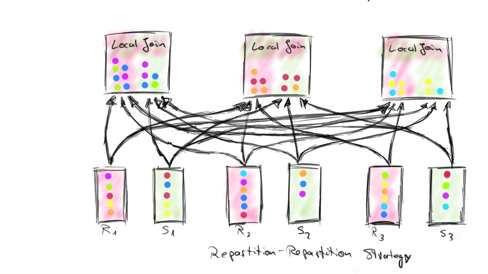
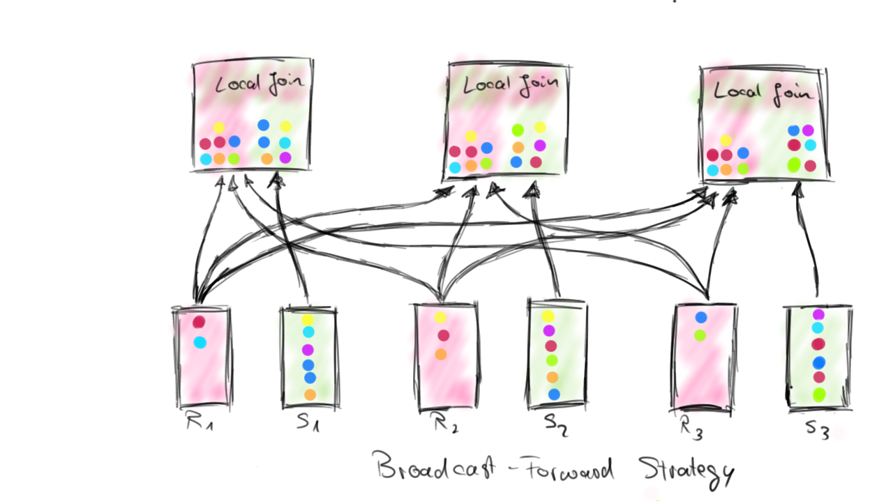
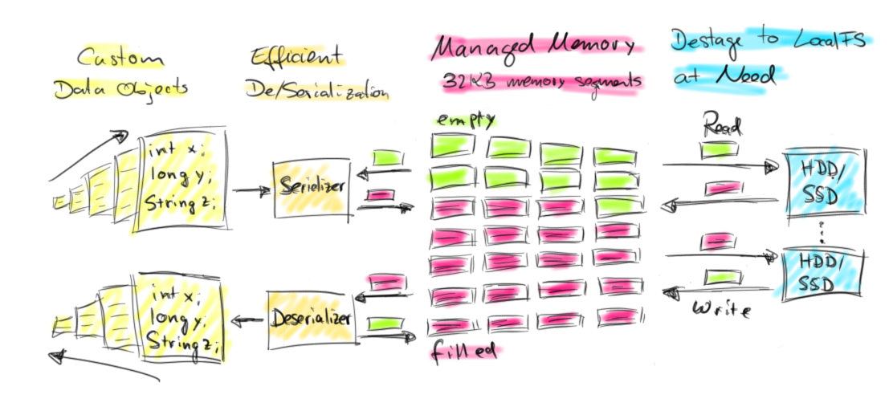
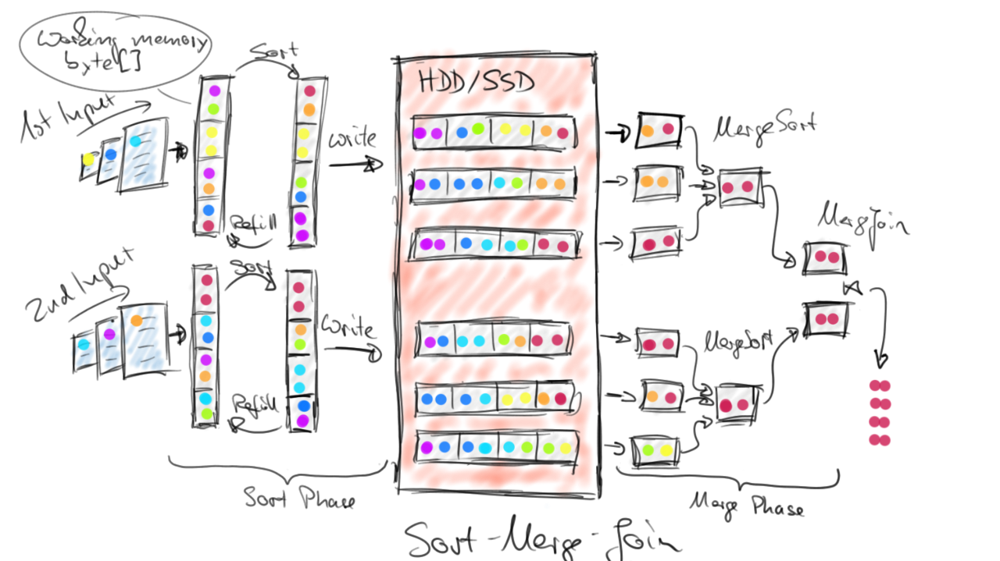
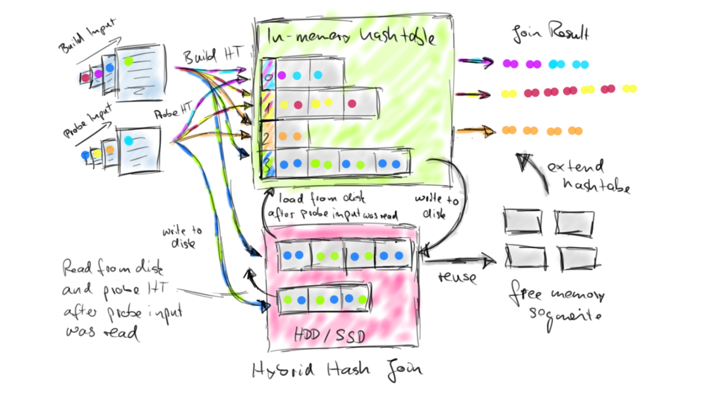
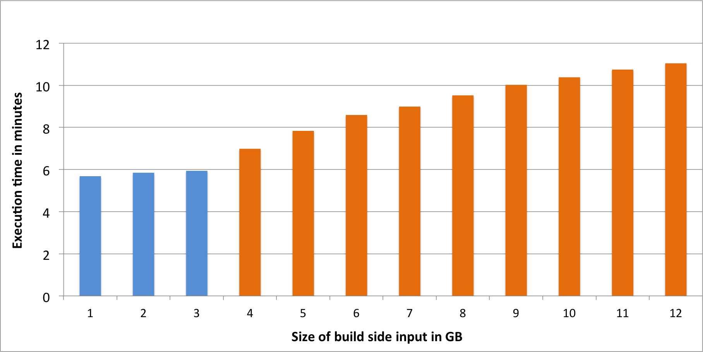
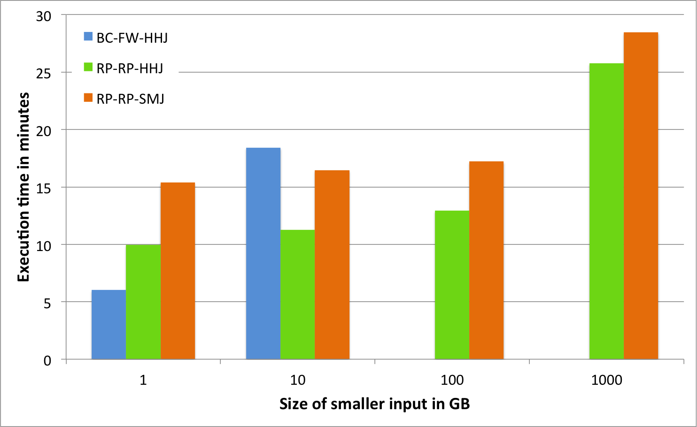

#Peeking into Apache Flink's Engine Room
> 13 Mar 2015 by Fabian Hüske ([@fhueske](https://twitter.com/fhueske))

##Join Processing in Apache Flink

Joins are prevalent operations in many data processing applications. Most data processing systems feature APIs that make joining data sets very easy. However, the internal algorithms for join processing are much more involved – especially if large data sets need to be efficiently handled. Therefore, join processing serves as a good example to discuss the salient design points and implementation details of a data processing system.

In this blog post, we cut through Apache Flink’s layered architecture and take a look at its internals with a focus on how it handles joins. Specifically, I will

- show how easy it is to join data sets using Flink’s fluent APIs,
- discuss basic distributed join strategies, Flink’s join implementations, and its memory management,
- talk about Flink’s optimizer that automatically chooses join strategies,
- show some performance numbers for joining data sets of different sizes, and finally
- briefly discuss joining of co-located and pre-sorted data sets.

*Disclaimer*: This blog post is exclusively about equi-joins. Whenever I say “join” in the following, I actually mean “equi-join”.
## Flink中的Join操作
在许多的数据处理应用中，Join是十分流行的操作算子。大多数数据处理系统都会凸显这个API，使得在这些系统上进行数据集的join十分容易。但是，join操作涉及到的内部算法却是十分复杂的，尤其当大数据集需要进行高效处理时更是如此。因此，join操作是一个很好的例子，通过它可以讨论一个数据处理系统中的主要设计点和实现细节。
在这篇博客中，我们剖开Flink的体系结构的外衣，到它内部一窥究竟，并聚焦在它是如何进行join的。特别指出，我将讨论如下内容：

- 展示使用Flink的API对数据集进行join操作的便利性
- 讨论基本的分布式join策略，Flink对join的实现，以及它的内存管理机制
- 论述Flink的优化器如何能够自动选择join策略
- 展示针对不同大小的数据集进行join操作时的性能数据，最后
- 简要讨论已经存在在本地的和预排序的数据集上进行的join操作。

*免责声明*：这篇博客中仅仅讨论了等值连接（equi-join）。在接下来的部分中无论何时提及“join”都意味着“equi-join”。

## How do I join with Flink?

Flink provides fluent APIs in Java and Scala to write data flow programs. Flink’s APIs are centered around parallel data collections which are called data sets. data sets are processed by applying Transformations that compute new data sets. Flink’s transformations include Map and Reduce as known from MapReduce [1] but also operators for joining, co-grouping, and iterative processing. The documentation gives an overview of all available transformations [2].

Joining two Scala case class data sets is very easy as the following example shows:
```scala
// define your data types
case class PageVisit(url: String, ip: String, userId: Long)
case class User(id: Long, name: String, email: String, country: String)

// get your data from somewhere
val visits: DataSet[PageVisit] = ...
val users: DataSet[User] = ...

// filter the users data set
val germanUsers = users.filter((u) => u.country.equals("de"))
// join data sets
val germanVisits: DataSet[(PageVisit, User)] =
      // equi-join condition (PageVisit.userId = User.id)
     visits.join(germanUsers).where("userId").equalTo("id")
```
Flink’s APIs also allow to:

- apply a user-defined join function to each pair of joined elements instead returning a `($Left, $Right)` tuple,
- select fields of pairs of joined Tuple elements (projection), and
- define composite join keys such as `.where(“orderDate”, “zipCode”).equalTo(“date”, “zip”)`.

See the documentation for more details on Flink’s join features [3].

## 在Flink中如何使用join
Flink提供了十分方便的API来编写数据流程序，目前支持java和scala。Flink的API围绕并行数据集合（data collection）－－被称作数据集（data set）展开。通过在数据集上应用转换操作（Transformation）来计算新的数据集。Flink的转换操作包括Map和Reduce，这是众所周知的来自于MapReduce[[1]](http://research.google.com/archive/mapreduce.html),同时还有用于join、co-group和迭代（iterative）的操作。这篇文档提供了所有可用转换操作的一个概要介绍[[2]](http://ci.apache.org/projects/flink/flink-docs-release-0.8/dataset_transformations.html)。
对两个Scala case class的数据集进行join是十分容易的，参考接下来的例子：
```scala
// define your data types
case class PageVisit(url: String, ip: String, userId: Long)
case class User(id: Long, name: String, email: String, country: String)

// get your data from somewhere
val visits: DataSet[PageVisit] = ...
val users: DataSet[User] = ...

// filter the users data set
val germanUsers = users.filter((u) => u.country.equals("de"))
// join data sets
val germanVisits: DataSet[(PageVisit, User)] =
      // equi-join condition (PageVisit.userId = User.id)
     visits.join(germanUsers).where("userId").equalTo("id")
```
Flink的API同样允许：

- 将用户自定义的join函数应用在join后的每一对元素上，并返回一个类似于`($Left, $Right)`元组
- 支持在join后的元组对上选择字段（投影操作），同时
- 可以定义组合join键比如：`.where(“orderDate”, “zipCode”).equalTo(“date”, “zip”)`

有关Flink join特性的更多细节可以参考这篇文章[[3]](http://ci.apache.org/projects/flink/flink-docs-release-0.8/dataset_transformations.html#join)。

##How does Flink join my data?

Flink uses techniques which are well known from parallel database systems to efficiently execute parallel joins. A join operator must establish all pairs of elements from its input data sets for which the join condition evaluates to true. In a standalone system, the most straight-forward implementation of a join is the so-called nested-loop join which builds the full Cartesian product and evaluates the join condition for each pair of elements. This strategy has quadratic complexity and does obviously not scale to large inputs.

In a distributed system joins are commonly processed in two steps:

1. The data of both inputs is distributed across all parallel instances that participate in the join and
2. each parallel instance performs a standard stand-alone join algorithm on its local partition of the overall data.

The distribution of data across parallel instances must ensure that each valid join pair can be locally built by exactly one instance. For both steps, there are multiple valid strategies that can be independently picked and which are favorable in different situations. In Flink terminology, the first phase is called Ship Strategy and the second phase Local Strategy. In the following I will describe Flink’s ship and local strategies to join two data sets R and S.
##Flink如何join数据
Flink使用的是并行数据库系统中用于高效执行并行join的技术，而这是十分出名的。一个join算子必须从他的输入数据集中创建所有的元素对，这些元素在join条件处被判断为`true`，即相等。在一个standalone系统中，join的最直接实现方式被称之为nest-loop join，它将构建完整的笛卡尔积，并对每一个元素对的join条件进行判断。这个策略具有平方级复杂度，显而易见的它不能被扩展到大的输入数据集上。
在一个分布式系统中，join操作通常被拆成两个阶段进行：

1. 两个输入的数据要被分布，其分布在所有参与到join操作的并行实例上（此处说的实例可以理解为分布式的节点机器）
2. 每一个并行实例执行一个标准的stand-alone join算法，其处理的数据是所有数据中分配到这个实例上的一个分片（partition）。

数据的分布横跨了并行的实例，这就需要保证每一个合法的join对，能被exactly one实例进行计算。对于每一步，都有多种合理的策略，可以保证独立的挑选，但对于不同的应用场景这些策略各有所长。在Flink的术语中，第一个阶段被称为传递策略（ship strategy），第二个阶段被称为本地计算策略（local strategy）。接下来将讨论Flink在对两个数据集*R*和*S*进行操作时可以使用的传递和本地计算策略。

###Ship Strategies

Flink features two ship strategies to establish a valid data partitioning for a join:

- the Repartition-Repartition strategy (RR) and
- the Broadcast-Forward strategy (BF).

The Repartition-Repartition strategy partitions both inputs, R and S, on their join key attributes using the same partitioning function. Each partition is assigned to exactly one parallel join instance and all data of that partition is sent to its associated instance. This ensures that all elements that share the same join key are shipped to the same parallel instance and can be locally joined. The cost of the RR strategy is a full shuffle of both data sets over the network.
###传递策略
Flink为保证为join构建一个合法的数据分布提出了两个传递策略：

- 重分布－重分布策略（Repartition-Repartition, RR）和
- 广播－向前策略（Broadcast-Forward, BF）

这个RR策略将对输入数据集R和S都进行重分布，在其join key的属性上，使用相同的重分布函数。每一个分区都将被分配一个并行的join实例，同时那个分区上所有的数据都将被发送给其相应的实例。这就保证了所有的元素只要其具有相同的join key都将被传递到同一个并行实例上，然后可以进行本地join操作。RR策略的开销将是两个数据集在网络中的全路由。


The Broadcast-Forward strategy sends one complete data set (R) to each parallel instance that holds a partition of the other data set (S), i.e., each parallel instance receives the full data set R. Data set S remains local and is not shipped at all. The cost of the BF strategy depends on the size of R and the number of parallel instances it is shipped to. The size of S does not matter because S is not moved. The figure below illustrates how both ship strategies work.

BF策略将吧其中一个数据集（R）发送给所有并行实例，而这些并行实例每一个都持有另一个数据集（S）的一个分区，也就是说，每个并行实例都将收到完整的数据集R。数据集S保留在本地并且不被传递。BF策略的开销依赖于R的大小和它需要被传递的并行实例的数量。S的大小对这个过程没有影响，因为S不被移动。下面的图展示了这个传递策略是如何工作的：


The Repartition-Repartition and Broadcast-Forward ship strategies establish suitable data distributions to execute a distributed join. Depending on the operations that are applied before the join, one or even both inputs of a join are already distributed in a suitable way across parallel instances. In this case, Flink will reuse such distributions and only ship one or no input at all.

RR和BF传递策略为执行分布式的join操作准备好了一个合适的数据分布。依赖于进行join操作之前的算子，如果一个或两个用于进行join操作的输入已经在并行实例上存在一个合适的分布式分区方式，在这种情况下，Flink可以重用这个分区，只传递一个输入数据或一个都不传递。

###Flink’s Memory Management

Before delving into the details of Flink’s local join algorithms, I will briefly discuss Flink’s internal memory management. Data processing algorithms such as joining, grouping, and sorting need to hold portions of their input data in memory. While such algorithms perform best if there is enough memory available to hold all data, it is crucial to gracefully handle situations where the data size exceeds memory. Such situations are especially tricky in JVM-based systems such as Flink because the system needs to reliably recognize that it is short on memory. Failure to detect such situations can result in an OutOfMemoryException and kill the JVM.

Flink handles this challenge by actively managing its memory. When a worker node (TaskManager) is started, it allocates a fixed portion (70% by default) of the JVM’s heap memory that is available after initialization as 32KB byte arrays. These byte arrays are distributed as working memory to all algorithms that need to hold significant portions of data in memory. The algorithms receive their input data as Java data objects and serialize them into their working memory.

This design has several nice properties. First, the number of data objects on the JVM heap is much lower resulting in less garbage collection pressure. Second, objects on the heap have a certain space overhead and the binary representation is more compact. Especially data sets of many small elements benefit from that. Third, an algorithm knows exactly when the input data exceeds its working memory and can react by writing some of its filled byte arrays to the worker’s local filesystem. After the content of a byte array is written to disk, it can be reused to process more data. Reading data back into memory is as simple as reading the binary data from the local filesystem. The following figure illustrates Flink’s memory management.

###Flink的内存管理
在深入进行Flink的本地join算法细节之前，我将简要论述下Flink的内部内存管理机制。数据处理算法如join、group、sort需要将输入数据的一部分保存在内存中。只有当有足够大的内存可以使用来保存所有的数据，这些算法才能有最佳表现，而如何优雅地应对数据大小超出内存的情况将是极其重要的。而这种情况在基于JVM的系统（比如Flink）中是更加棘手的，这是因为系统需要可靠的识别出内存的短缺情况。一旦对这种情况没有检测到，将导致OOM异常（OutOfMemoryException），并杀死JVM。
Flink通过积极地管理自己的内存来应对这个挑战。当一个工作节点（TaskManager）启动后，他将申请一个固定比例的（默认是70%）JVM的堆内存，等待初始化之后这些内存将被整理成32KB固定大小的字节数组等待使用。这些字节数组是对工作内存的重新分配，对所有的算法来说，都将在内存中保留最重要的一部分数据。算法收到的输入数据是Java数据对象，并且是在工作内存中的序列化后的内容。
这个设计有几个优良的特性。第一，在JVM队中的数据对象数量是很少的，对垃圾回收造成的压力是十分有限的。第二，位于堆中的对象具有一个固定的大小，同时二进制的表达形式具有更好的兼容性。尤其当许多小元素组成的数据集将从中获得可观的收益。第三，算法可以准确地知道输入数据是否超出其工作内存，并可以采取应对手段－－将填充好的一部分字节数组写出到工作节点的本地文件系统中。当一个自己数组的内容写出到了磁盘，它将可以被重用来处理更多数据。将数据读取出来是十分简单的即：从本地文件系统中读取二进制数据。下面的图展示了Flink的内存管理机制：


This active memory management makes Flink extremely robust for processing very large data sets on limited memory resources while preserving all benefits of in-memory processing if data is small enough to fit in-memory. De/serializing data into and from memory has a certain cost overhead compared to simply holding all data elements on the JVM’s heap. However, Flink features efficient custom de/serializers which also allow to perform certain operations such as comparisons directly on serialized data without deserializing data objects from memory.
积极的内存管理机制使得Flink在受内存资源限制的情况下处理超大数据集时具有极强的鲁棒性，同时当数据足够小可以放在内存中时，Flink还可以获得内存处理的全部益处。与将所有数据存储在JVM的堆中相比，序列化／反序列化数据进出内存具有一个固定的开销。当然，Flink提供了足够强大的特性，允许用户自定义序列化／反序列化方法，其允许在特定的算子上针对序列化的数据直接执行比较（comparison），而不用再将数据从内存中反序列化一遍。


###Local Strategies

After the data has been distributed across all parallel join instances using either a Repartition-Repartition or Broadcast-Forward ship strategy, each instance runs a local join algorithm to join the elements of its local partition. Flink’s runtime features two common join strategies to perform these local joins:

- the Sort-Merge-Join strategy (SM) and
- the Hybrid-Hash-Join strategy (HH).

The Sort-Merge-Join works by first sorting both input data sets on their join key attributes (Sort Phase) and merging the sorted data sets as a second step (Merge Phase). The sort is done in-memory if the local partition of a data set is small enough. Otherwise, an external merge-sort is done by collecting data until the working memory is filled, sorting it, writing the sorted data to the local filesystem, and starting over by filling the working memory again with more incoming data. After all input data has been received, sorted, and written as sorted runs to the local file system, a fully sorted stream can be obtained. This is done by reading the partially sorted runs from the local filesystem and sort-merging the records on the fly. Once the sorted streams of both inputs are available, both streams are sequentially read and merge-joined in a zig-zag fashion by comparing the sorted join key attributes, building join element pairs for matching keys, and advancing the sorted stream with the lower join key. The figure below shows how the Sort-Merge-Join strategy works.
### 本地计算策略
在数据已经完成了分布式，将数据分布到并行的实例上之后，无论其使用的是RR或BF传递策略，每一个实例可以运行一个本地的join算法，在本地分区上对元素进行join操作。Flink在运行时具有两个有特色的通用的join策略，可以在本地join中使用：

- 排序融合join策略（Sort-Merge-Join, SM）和
- 混合Hash join策略（Hybrid-Hash-Join, HH）

其中SM策略首先将所有输入数据在其join key属性上进行排序（排序阶段），再将排序后的数据集进行融合是为第二阶段（融合阶段）。如果本地分区数据集足够小，排序过程是在内存中进行的。否则，使用外排算法（外部的merge－sort算法），其工作方法：先收集数据执导工作内存被占满，将其排序，并将结果写到本地文件系统，再次从填充工作内存开始来处理更多输入数据。当所有数据都收集到之后，排序好，并将结果写入到了本地文件系统，一个完整的排序好的流就可以得到了（merge－sort）。这是通过从文件系统中读取部分排序结果（多个partial并行读），并sort出结果数据流。当两个输入的排序数据流都可用了，两个流都有序读取，并像拉链一样完成merge－join操作，通过比较排序后的join key的属性，并为匹配上的key构建join后的元素对，并将小的join key所在的排序数据流向前移动。下图展示了SM策略的工作过程：


The Hybrid-Hash-Join distinguishes its inputs as build-side and probe-side input and works in two phases, a build phase followed by a probe phase. In the build phase, the algorithm reads the build-side input and inserts all data elements into an in-memory hash table indexed by their join key attributes. If the hash table outgrows the algorithm’s working memory, parts of the hash table (ranges of hash indexes) are written to the local filesystem. The build phase ends after the build-side input has been fully consumed. In the probe phase, the algorithm reads the probe-side input and probes the hash table for each element using its join key attribute. If the element falls into a hash index range that was spilled to disk, the element is also written to disk. Otherwise, the element is immediately joined with all matching elements from the hash table. If the hash table completely fits into the working memory, the join is finished after the probe-side input has been fully consumed. Otherwise, the current hash table is dropped and a new hash table is built using spilled parts of the build-side input. This hash table is probed by the corresponding parts of the spilled probe-side input. Eventually, all data is joined. Hybrid-Hash-Joins perform best if the hash table completely fits into the working memory because an arbitrarily large the probe-side input can be processed on-the-fly without materializing it. However even if build-side input does not fit into memory, the the Hybrid-Hash-Join has very nice properties. In this case, in-memory processing is partially preserved and only a fraction of the build-side and probe-side data needs to be written to and read from the local filesystem. The next figure illustrates how the Hybrid-Hash-Join works.
混合Hash join策略将其输入区分为构建方（build－side）和查询方（probe－side），并按两阶段进行工作：构建阶段、查询阶段。在构建阶段，算法读取构建方的输入，并将所有数据插入到一个基于内存的Hash table中，以在join key的属性上对数据进行索引（index）。如果Hash table的大小超过了算法的工作内存，部分Hash Table（也就是一部分hash索引）将被写入到本地文件系统。当构建方的所有数据都读取完成之后，构建阶段结束。在查询阶段，算法读取查询方的输入数据，对每一个元素，使用其join key的属性在hash table中进行查询。如果元素落入了hash索引被溢出到磁盘上的一部分，这个也将被写到磁盘上。否则，这个元素将立即join位于hash table中所有匹配的元素。如果hash table完整的放入了工作内存，在查询方的输入数据消费完成，整个join操作就得以完成。否则，当前内存中的hash table被删除，并利用构建方的溢出到磁盘中的部分数据重新构建一个hash table。这个hash table将使用溢出到磁盘的查询方的输入进行对应的查询。最终，所有的数据完成join。混合hash join只有在整个hash table可以完整放入工作内存中才有最佳性能表现，因为一个任意大小的查询方的输入可以一条条进行查询，而不需要将其实体化（materializing）。当然，即使构建方的数据不能完整放入到内存中，混合hash join仍有比较好的特性。在这种情况下，内存处理阶段可以部分保持效果，而且只有构建方和查询方的一部分数据需要写入／读出本地文件系统。下图展示了混合Hash join的工作过程：


How does Flink choose join strategies?

Ship and local strategies do not depend on each other and can be independently chosen. Therefore, Flink can execute a join of two data sets R and S in nine different ways by combining any of the three ship strategies (RR, BF with R being broadcasted, BF with S being broadcasted) with any of the three local strategies (SM, HH with R being build-side, HH with S being build-side). Each of these strategy combinations results in different execution performance depending on the data sizes and the available amount of working memory. In case of a small data set R and a much larger data set S, broadcasting R and using it as build-side input of a Hybrid-Hash-Join is usually a good choice because the much larger data set S is not shipped and not materialized (given that the hash table completely fits into memory). If both data sets are rather large or the join is performed on many parallel instances, repartitioning both inputs is a robust choice.

Flink features a cost-based optimizer which automatically chooses the execution strategies for all operators including joins. Without going into the details of cost-based optimization, this is done by computing cost estimates for execution plans with different strategies and picking the plan with the least estimated costs. Thereby, the optimizer estimates the amount of data which is shipped over the the network and written to disk. If no reliable size estimates for the input data can be obtained, the optimizer falls back to robust default choices. A key feature of the optimizer is to reason about existing data properties. For example, if the data of one input is already partitioned in a suitable way, the generated candidate plans will not repartition this input. Hence, the choice of a RR ship strategy becomes more likely. The same applies for previously sorted data and the Sort-Merge-Join strategy. Flink programs can help the optimizer to reason about existing data properties by providing semantic information about user-defined functions [4]. While the optimizer is a killer feature of Flink, it can happen that a user knows better than the optimizer how to execute a specific join. Similar to relational database systems, Flink offers optimizer hints to tell the optimizer which join strategies to pick [5].

## Flink如何选择join策略？
传递和本地计算策略双方互不依赖，可以被独立地选择。因此，Flink可以在两个进行join的数据集R和S上进行9中不同方式策略组合，通过对两个阶段的可选策略进行排列组合，其中三种传递策略（RR、BF使用R广播、BF使用S广播）、三种本地计算策略（SM、HH使用R作为构建方、HH使用S作为构建方）。每种策略组合都具有不同的执行性能表现，其依赖于数据集大小和可用的工作内存大小。在一个小的数据集R和一个大的数据集S的情况下，广播R并使用它作为混合hash join策略的构建方通常来说是一个好的选择，因为超大的数据集S不适合传递也不能实体化（这种策略恰好给定了适合放在内存的hash table）。如果两个数据集都比较大或者join操作在很多个并行实例上执行，将两个输入都重分区是一个鲁棒性很强的选择。
Flink提供了一个基于开销的优化器特性，这个优化器可以为所有的算子，包括join，自动选择执行策略。不需要过度深入了解基于开销的优化器的工作细节，它是通过为不同策略的执行计划计算开销的估算值（estimate），并选择具有最小估算开销的执行计划。因此，这个优化器要估算经过网络传递的数据量和写入到磁盘的数据量。如果针对获取的输入数据没有可靠的估算数值，优化器将选择鲁棒性好的作为默认选择。这个优化器的一个关键特点是可以推断存在于数据中的特征。比如，如果其中一个输入的数据已经按照合适的方式进行分区了，那么产生的候选计划将不再对这个输入进行重分区。因此，最可能的选择策略就是RR传递策略。类似的推理可以应用在之前已经排序过的数据上，以及这种情况下选择SM join策略。Flink程序可以帮助优化器推理数据属性，通过食用用户自定义函数给其提供静态信息[[4]](https://ci.apache.org/projects/flink/flink-docs-release-1.0/apis/batch/index.html#semantic-annotations)。对于Flink来说这个优化器就是一个杀手特性，它可以在用户比优化器更清楚数据属性时执行一个特定的join操作。与关系数据库系统类似，Flink提供优化提示，来告诉优化器选择哪种join策略[[5]](https://ci.apache.org/projects/flink/flink-docs-release-1.0/apis/batch/dataset_transformations.html#join-algorithm-hints)

How is Flink’s join performance?

Alright, that sounds good, but how fast are joins in Flink? Let’s have a look. We start with a benchmark of the single-core performance of Flink’s Hybrid-Hash-Join implementation and run a Flink program that executes a Hybrid-Hash-Join with parallelism 1. We run the program on a n1-standard-2 Google Compute Engine instance (2 vCPUs, 7.5GB memory) with two locally attached SSDs. We give 4GB as working memory to the join. The join program generates 1KB records for both inputs on-the-fly, i.e., the data is not read from disk. We run 1:N (Primary-Key/Foreign-Key) joins and generate the smaller input with unique Integer join keys and the larger input with randomly chosen Integer join keys that fall into the key range of the smaller input. Hence, each tuple of the larger side joins with exactly one tuple of the smaller side. The result of the join is immediately discarded. We vary the size of the build-side input from 1 million to 12 million elements (1GB to 12GB). The probe-side input is kept constant at 64 million elements (64GB). The following chart shows the average execution time of three runs for each setup.
##Flink join的表现如何？
好了，上面的内容听上去挺不错，那么在Flink中join操作究竟有多快呢？一起来看一下，我们首先做一个基线测试（benchmark），在单核上Flink的混合Hash join的表现，使用并行度1来运行Flink程序执行混合Hash join操作。我们运行这个程序的环境是n1-standard－2的GCE实例（2 vCPUs，7.5GB内存）使用两块本地的SSD。我们给定4GB工作内存来进行join操作。这个join程序产生的记录大小是1KB／record，对输入的数据都是这个大小，换句话说数据并不是从磁盘读取出来的。我们运行1:N（主键／外键）join，使用唯一的整数给小的输入产生join key，而大的输入使用随机选取整数的join key，并使其key落入到小输入的数据范围。这样一来大输入的每个元组都能在小的一方找到唯一相对应的元组。join的结果直接丢弃。通过将构建方的输入从100万增加到1200万元素（1GB到12GB）。查询方的输入保持在常数为6400万元素（64GB）。下表展示了每个设定下三次结果的平均执行时间。


The joins with 1 to 3 GB build side (blue bars) are pure in-memory joins. The other joins partially spill data to disk (4 to 12GB, orange bars). The results show that the performance of Flink’s Hybrid-Hash-Join remains stable as long as the hash table completely fits into memory. As soon as the hash table becomes larger than the working memory, parts of the hash table and corresponding parts of the probe side are spilled to disk. The chart shows that the performance of the Hybrid-Hash-Join gracefully decreases in this situation, i.e., there is no sharp increase in runtime when the join starts spilling. In combination with Flink’s robust memory management, this execution behavior gives smooth performance without the need for fine-grained, data-dependent memory tuning.

在构建方从1GB－3GB时（蓝色柱）join操作时纯内存join操作。其它的join操作都有部分数据溢出到磁盘（4GB到12GB，橘色柱）。这个结果说明在hash table能够完整放入内存时，Flink的混合Hash join的性能能够保持稳定。随着Hash table变大，超过了工作内存，部分Hash table和相应的查询方内容溢出到磁盘。这个图标说明在这种情况下混合Hash join的性能优雅的降下来了，也就是说这里没有在运行时当join开始启动溢出时产生一个尖锐的增加。与Flink的高鲁棒性的内存管理机制结合起来，这个执行表现给出了一个平滑的性能表现，而不需要调教，不需要依赖数据的内存调优。

So, Flink’s Hybrid-Hash-Join implementation performs well on a single thread even for limited memory resources, but how good is Flink’s performance when joining larger data sets in a distributed setting? For the next experiment we compare the performance of the most common join strategy combinations, namely:

- Broadcast-Forward, Hybrid-Hash-Join (broadcasting and building with the smaller side),
- Repartition, Hybrid-Hash-Join (building with the smaller side), and
- Repartition, Sort-Merge-Join

for different input size ratios:

- 1GB : 1000GB
- 10GB : 1000GB
- 100GB : 1000GB
- 1000GB : 1000GB

The Broadcast-Forward strategy is only executed for up to 10GB. Building a hash table from 100GB broadcasted data in 5GB working memory would result in spilling proximately 95GB (build input) + 950GB (probe input) in each parallel thread and require more than 8TB local disk storage on each machine.

As in the single-core benchmark, we run 1:N joins, generate the data on-the-fly, and immediately discard the result after the join. We run the benchmark on 10 n1-highmem-8 Google Compute Engine instances. Each instance is equipped with 8 cores, 52GB RAM, 40GB of which are configured as working memory (5GB per core), and one local SSD for spilling to disk. All benchmarks are performed using the same configuration, i.e., no fine tuning for the respective data sizes is done. The programs are executed with a parallelism of 80.
由此，Flink的混合Hash join实现在单线程上应对受限制内存资源时能够表现不错，但是当在一个分布式设定场景下进行大数据集的join操作时Flink的性能表现有多好呢？下一个实验我们将比较通常的join策略组合，如下：

- BF、HH（广播和构建方都是使用较小的一方）
- RR、HH（构建使用较小的一方）
- RR、SM

针对不同的输入数据量：

- 1GB : 1000GB
- 10GB : 1000GB
- 100GB : 1000GB
- 1000GB : 1000GB

在BF的策略上仅仅执行到10GB。从100GB的广播数据中构建Hash表，在只有5GB工作内存的情况下溢出结果集达到95GB（构建方）＋950GB（查询方）对每个并发线程都是这个压力，在每个机器上将需要超过8TB的本地磁盘存储。
作为单核的基线测试，我们运行了1:N的join，在内存中产生数据，并且在join完成后立即丢弃该数据。我们运行这个基线测试实在10台n1-highmem－8的GCE实例上完成的。每个实例配备了8核，52GB内存（RAM），40GB用来配置工作内存（每个core有5GB），存在1个本地SSD可以将溢出的内容写磁盘。所有的基线测试均是在同样的配置下的性能表现，也就是说，没有为某个数据集进行专门的调优。程序使用的并行度时80。


As expected, the Broadcast-Forward strategy performs best for very small inputs because the large probe side is not shipped over the network and is locally joined. However, when the size of the broadcasted side grows, two problems arise. First the amount of data which is shipped increases but also each parallel instance has to process the full broadcasted data set. The performance of both Repartitioning strategies behaves similar for growing input sizes which indicates that these strategies are mainly limited by the cost of the data transfer (at max 2TB are shipped over the network and joined). Although the Sort-Merge-Join strategy shows the worst performance all shown cases, it has a right to exist because it can nicely exploit sorted input data.
正如预料的一样，BF策略在输入很小的时候表现最好，因为大的查询方不需要通过网络传递，只需要进行本地join。但是，当广播侧的数据量逐渐增长时，会引起两个问题。第一在传递阶段的数据量增加了，但每个并行实例必须处理所有的广播数据。而RR策略的性能表现与数据量增长更相近，这意味着这个策略最主要的限制时数据传输的开销（经过网络最大能到2TB的传递和join）。虽然这个SM join策略在所有展示的案例中都展现了最差的性能表现，它仍有存在的意义，因为它可以很好地利用已经排序过的输入数据

## I’ve got sooo much data to join, do I really need to ship it?

We have seen that off-the-shelf distributed joins work really well in Flink. But what if your data is so huge that you do not want to shuffle it across your cluster? We recently added some features to Flink for specifying semantic properties (partitioning and sorting) on input splits and co-located reading of local input files. With these tools at hand, it is possible to join pre-partitioned data sets from your local filesystem without sending a single byte over your cluster’s network. If the input data is even pre-sorted, the join can be done as a Sort-Merge-Join without sorting, i.e., the join is essentially done on-the-fly. Exploiting co-location requires a very special setup though. Data needs to be stored on the local filesystem because HDFS does not feature data co-location and might move file blocks across data nodes. That means you need to take care of many things yourself which HDFS would have done for you, including replication to avoid data loss. On the other hand, performance gains of joining co-located and pre-sorted can be quite substantial.

##我有大量数据需要join，那我真的需要传递它？
我们可以看到在Flink中有现成的分布式join可以工作地很好。但如果你的数据过于巨大（huge）以至于你不想通过集群对其进行shuffle，租要怎么办？最近，我们在Flink中添加了一些特性，可以指定语义属性（分区、排序）在输入数据上，当这些数据已经分区了并且已经局部访问了。使用这些趁手的工具，是的在预分区好的数据集上进行join操作成为可能，而不需要将这些数据在你的集群网络中传输一个字节。如果输入数据已经是预排序的，这个join可以进行去掉sorting的SM join，即这个join大体上是来一条处理一条（on the fly）。充分利用局部性（co－location）需要一个特殊的设计。数据需要存储在本地文件系统，因为HDFS不具有数据局部性，他可能在数据节点间移动文件块。这意味着你需要额外处理很多事情，而这些正是HDFS帮你做的，包括拷贝以防止数据丢失。另一方面来说，利用局部性和预排序获得的性能上的提升是相当巨大的。

## tl;dr: What should I remember from all of this?

- Flink’s fluent Scala and Java APIs make joins and other data transformations easy as cake.
- The optimizer does the hard choices for you, but gives you control in case you know better.
- Flink’s join implementations perform very good in-memory and gracefully degrade when going to disk.
- Due to Flink’s robust memory management, there is no need for job- or data-specific memory tuning to avoid a nasty OutOfMemoryException. It just runs out-of-the-box.

## 我应该从中记住什么？

- Flink的提供了Scala和Java API支持join和其它数据转换操作，很容易上手。
- 优化器为你做出了艰难的选择，并且当某些情况下你确定你能做的更好时，可以控制它。
- Flink的join实现性能在内存放的下的情况下表现优良，而且当溢出到磁盘时是一个优雅的性能衰减过程。
- 由于Flink鲁棒性的内存管理机制，不需要针对job或数据进行专门的内存调优，这些操作往往是为了避免讨厌的OutOfMemoryException。Flink是开箱即用的。


References

[1] [“MapReduce: Simplified data processing on large clusters”](http://flink.apache.org/news/2015/03/13/peeking-into-Apache-Flinks-Engine-Room.html), Dean, Ghemawat, 2004
[2] [Flink 0.8.1 documentation: Data Transformations](http://ci.apache.org/projects/flink/flink-docs-release-0.8/dataset_transformations.html)
[3] [Flink 0.8.1 documentation: Joins](http://ci.apache.org/projects/flink/flink-docs-release-0.8/dataset_transformations.html#join)
[4] [Flink 1.0 documentation: Semantic annotations](https://ci.apache.org/projects/flink/flink-docs-release-1.0/apis/batch/index.html#semantic-annotations)
[5] [Flink 1.0 documentation: Optimizer join hints](https://ci.apache.org/projects/flink/flink-docs-release-1.0/apis/batch/dataset_transformations.html#join-algorithm-hints)